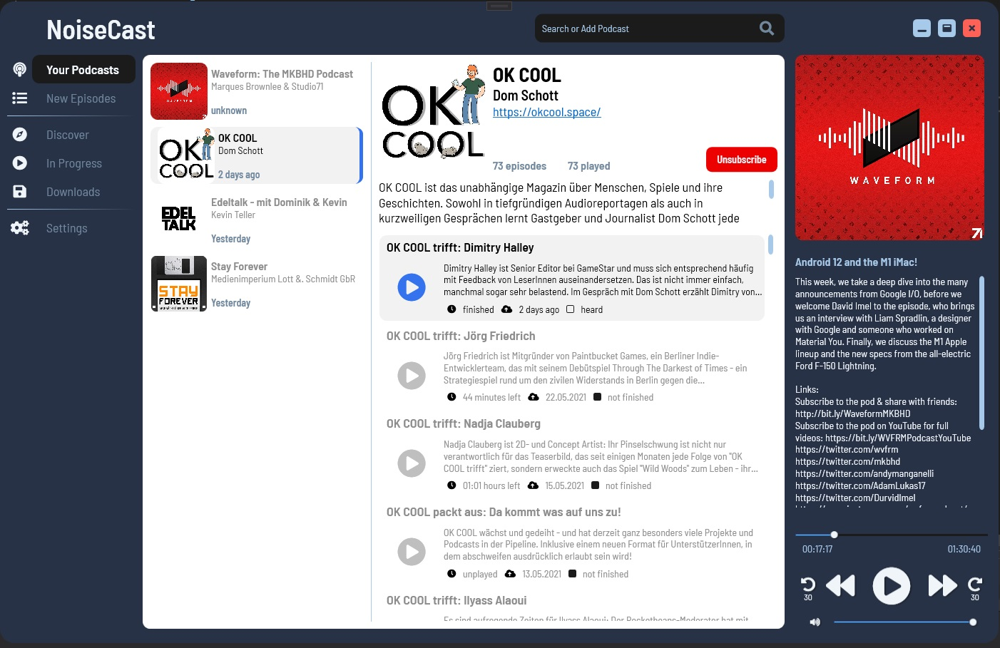

# NoiseCast

Podcast player, build in MVVM design

## Description

### Dependencies

* CodeHollow's FeedReader
* FontAwesome 5 Font

## Authors

Michael Barth
[Email](sakenda1207@gmail.com)

## Version History

* See [commit change]()

## License

This project is not licensed and free to use

## Acknowledgments

* [FontAwesome](https://fontawesome.com/)
* [FeedReader](https://github.com/codehollow/FeedReader/)
